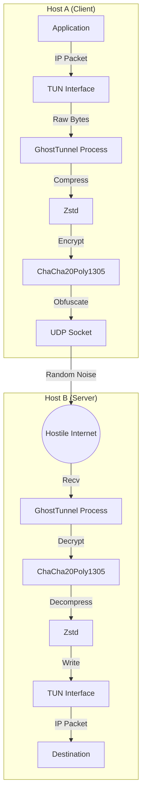

# 👻 GhostTunnel (Rusty Low-Bandwidth VPN)


> **"Standard VPNs fail on packet loss. GhostTunnel thrives on it."**

## 📖 The Why
Most VPNs (OpenVPN, WireGuard) are designed for stable, high-bandwidth connections. When packet loss hits 20% or latency spikes, they stall or drop the connection entirely.

**GhostTunnel** is different. It's built for **hostile networks**:
- 🛡️ **UDP-only Transport** with custom reliability layer.
- 📉 **Adaptive Compression** (Zstd) to squeeze data through tiny pipes.
- 🕵️ **Obfuscation** to look like random noise (anti-DPI).
- 🖥️ **TUI Dashboard** for real-time monitoring without a browser.

## 🚀 Quick Start

### Option 1: Docker (Recommended)
No Rust installed? No problem.
```bash
docker build -t ghost_tunnel .
docker run --cap-add=NET_ADMIN --device=/dev/net/tun ghost_tunnel --help
```

### Option 2: Cargo (For Hackers)
```bash
# Build the project
make build

# Run Server (Listen on 0.0.0.0:8000)
make run-server

# Run Client (Connect to local server)
make run-client
```

## 🏗️ Architecture



## 🛠️ Features
- **Chaos Mode**: Simulate partial network failure to test resilience.
- **TUI Dashboard**: Matrix-style terminal interface.
- **Zero Config**: Works out of the box with sensible defaults.

## 🧪 Testing Chaos
Want to see it survive 30% packet loss?
```bash
make test-chaos
```
*Watch the TUI throughput stay alive while packet loss spikes!*
